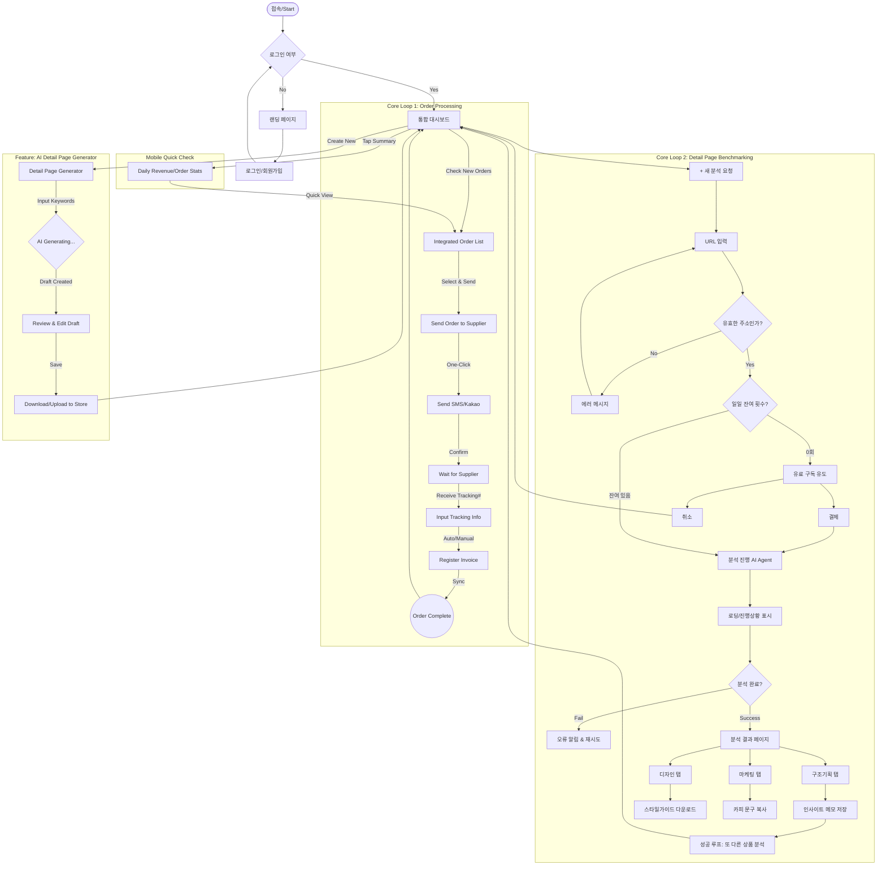

# User Flow - SmartStore Comprehensive Solution

> **Version:** 2.0 (Merged)
> **Date:** 2026-01-05

## Unified User Journey

## Key User Paths

### Path 1: Daily Order Management (매일 주문 관리)
1. **Login** → Dashboard
2. **View** → New orders in integrated list
3. **Select** → Orders to send to supplier
4. **Send** → One-click SMS/Kakao to supplier
5. **Input** → Tracking numbers (auto/manual)
6. **Complete** → Order status updated

**Success Criteria**: < 5 minutes for 10 orders

### Path 2: Competitive Analysis (경쟁사 분석)
1. **Discover** → 경쟁사 상세페이지 발견 (Mobile/PC)
2. **Input** → URL 입력
3. **Wait** → AI 분석 진행 (30초 이내)
4. **Review** → 구조/디자인/마케팅 탭 탐색
5. **Save** → 인사이트 메모, 스타일 가이드 다운로드
6. **Apply** → 내 상품 상세페이지에 적용

**Success Criteria**: 주 3회 이상 재방문

### Path 3: AI Detail Page Creation (AI 상세페이지 생성)
1. **Start** → Detail Page Generator
2. **Input** → 상품 키워드, 주요 특징
3. **Generate** → AI 초안 생성
4. **Review** → 생성된 콘텐츠 검토 및 수정
5. **Download** → HTML/이미지 다운로드
6. **Upload** → 스마트스토어에 업로드

**Success Criteria**: 기획 시간 50% 단축
