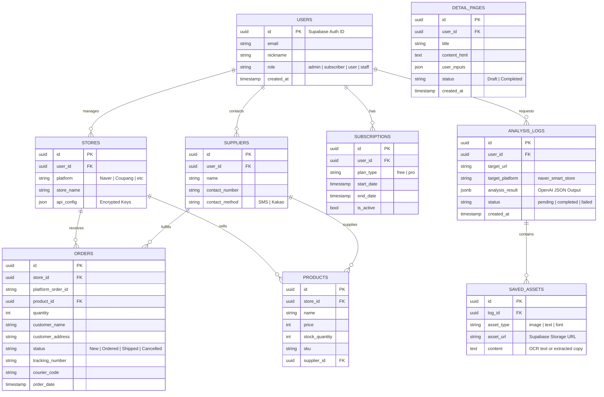

# Database Design - SmartStore Comprehensive Solution

> **Version:** 2.0 (Merged)
> **Date:** 2026-01-05

## Unified ERD (Entity Relationship Diagram)

## Key Entities

### Core Entities
- **USERS**: 사용자 기본 정보 및 역할(RBAC) 관리
- **STORES**: 사용자가 관리하는 스토어 정보 (플랫폼, API 설정)
- **SUPPLIERS**: 상품 공급자 정보 및 연락처 관리
- **PRODUCTS**: 판매 상품 정보 (재고, 가격, SKU)
- **ORDERS**: 주문 정보 (상태, 배송 추적, 고객 정보)

### Subscription & Analytics
- **SUBSCRIPTIONS**: 유료/무료 플랜 상태 관리
- **ANALYSIS_LOGS**: 분석 요청 이력. `analysis_result` 컬럼에 AI가 분석한 비정형 데이터(구조, 디자인, 카피 정보)를 JSON 형태로 유연하게 저장
- **SAVED_ASSETS**: 분석 과정에서 추출된 중요한 이미지나 텍스트 조각을 별도로 저장하여 즐겨찾기 등에 활용
- **DETAIL_PAGES**: AI로 생성된 상세페이지 초안 저장

## Indexes & Performance

### Frequently Queried Fields
- `ORDERS.order_date` (DESC)
- `ORDERS.status`
- `ORDERS.store_id`
- `ANALYSIS_LOGS.user_id`
- `ANALYSIS_LOGS.created_at` (DESC)
- `PRODUCTS.sku`

### Composite Indexes
- `(user_id, created_at)` on ANALYSIS_LOGS
- `(store_id, order_date)` on ORDERS
- `(status, order_date)` on ORDERS

## Row Level Security (RLS) Policies

### USERS Table
- Users can only read/update their own record

### ORDERS, PRODUCTS, STORES
- Users can only access data from stores they own
- Staff role can read but not delete

### ANALYSIS_LOGS, SAVED_ASSETS
- Users can only access their own analysis results
- Admins have full access

### SUBSCRIPTIONS
- Users can read their own subscription
- Only admins can modify
