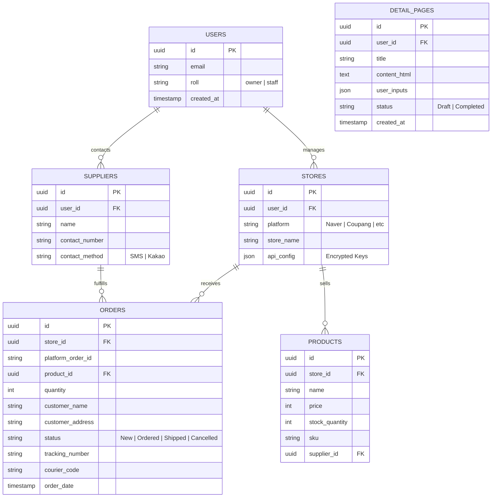

# Database Schema Design - SmartStore Manager

```mermaid
erDiagram
    USERS ||--o{ STORES : manages
    USERS ||--o{ SUPPLIERS : contacts
    STORES ||--o{ ORDERS : receives
    STORES ||--o{ PRODUCTS : sells
    
    SUPPLIERS ||--o{ ORDERS : fulfills
    
    USERS {
        uuid id PK
        string email
        string roll "owner | staff"
        timestamp created_at
    }
    
    STORES {
        uuid id PK
        uuid user_id FK
        string platform "Naver | Coupang | etc"
        string store_name
        json api_config "Encrypted Keys"
    }
    
    SUPPLIERS {
        uuid id PK
        uuid user_id FK
        string name
        string contact_number
        string contact_method "SMS | Kakao"
    }
    
    PRODUCTS {
        uuid id PK
        uuid store_id FK
        string name
        int price
        int stock_quantity
        string sku
        uuid supplier_id FK
    }

    ORDERS {
        uuid id PK
        uuid store_id FK
        string platform_order_id
        uuid product_id FK
        int quantity
        string customer_name
        string customer_address
        string status "New | Ordered | Shipped | Cancelled"
        string tracking_number
        string courier_code
        timestamp order_date
    }
    
    DETAIL_PAGES {
        uuid id PK
        uuid user_id FK
        string title
        text content_html
        json user_inputs
        string status "Draft | Completed"
        timestamp created_at
    }
```
