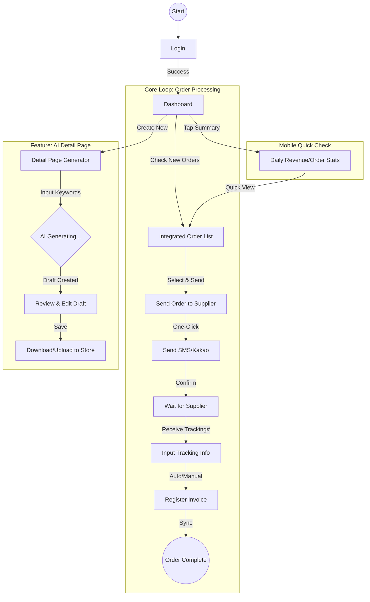

# User Flow - SmartStore Manager

```mermaid
graph TD
    Start((Start)) --> Login
    Login -->|Success| Dashboard
    
    subgraph "Core Loop: Order Processing"
        Dashboard -->|Check New Orders| OrderList[Integrated Order List]
        OrderList -->|Select & Send| SendOrder[Send Order to Supplier]
        SendOrder -->|One-Click| SMS[Send SMS/Kakao]
        SMS -->|Confirm| StatusWait[Wait for Supplier]
        StatusWait -->|Receive Tracking#| InputTracking[Input Tracking Info]
        InputTracking -->|Auto/Manual| Invoice[Register Invoice]
        Invoice -->|Sync| Complete((Order Complete))
    end
    
    subgraph "Feature: AI Detail Page"
        Dashboard -->|Create New| PageGen[Detail Page Generator]
        PageGen -->|Input Keywords| AI_Process{AI Generating...}
        AI_Process -->|Draft Created| Editor[Review & Edit Draft]
        Editor -->|Save| Download[Download/Upload to Store]
    end
    
    subgraph "Mobile Quick Check"
        Dashboard -->|Tap Summary| DailyStats[Daily Revenue/Order Stats]
        DailyStats -->|Quick View| OrderList
    end
```
